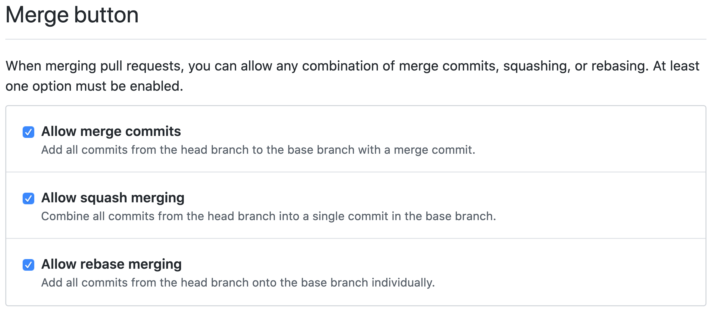
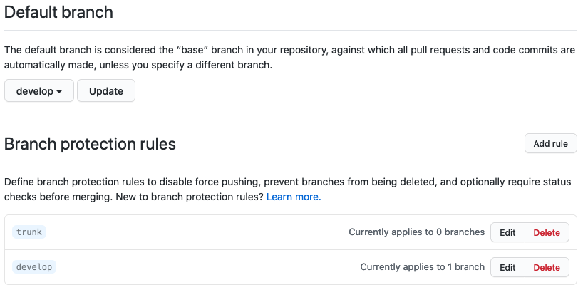
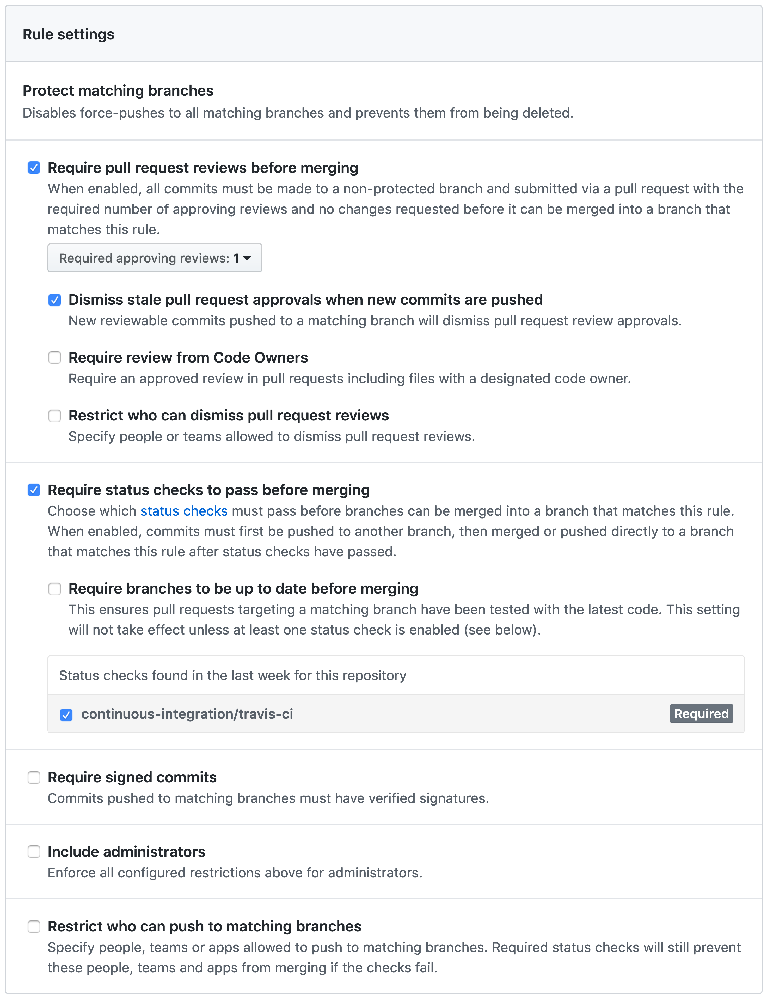

The following items are required across all repositories managed by our Open Source Practice team.  By keeping the same experience across all our repositories, it makes it easier for 10uppers and external contributors to work within any repository and operate with the same assumptions as any other 10up repository.

<h2 id="issue-pr-labels" class="anchor-heading">Issue and PR labels  </h2>

The following labels will our standard set of labels across all open source repositories to help ensure we use clear and consistent labelling terminology.  This will allow us to see the status and type of all issues at a glance, to help track and report on contributions across our repositories, and to provide easier ways to find issues to contribute to (e.g., all `needs:ux` and `good-first-issues`).  We’re starting a minimal set of labels and will let progressive enhancement further define them for us as well as perform occasional housekeeping.
- `type:bug` - “Something isn't working.” (color: #d73a4a)
- `type:enhancement` - “New feature or request.” (color: #a2eeef)
- [`type:good-first-issue`](https://github.com/issues?utf8=%E2%9C%93&q=is%3Aopen+is%3Aissue+user%3A10up+no%3Aassignee+label%3Atype%3Agood-first-issue) - “Good for newcomers.” (color: #993299)
- `type:question` - “Further information is requested.” (color: #d876e3)
- [`needs:engineering`](https://github.com/issues?utf8=%E2%9C%93&q=is%3Aopen+is%3Aissue+user%3A10up+no%3Aassignee+label%3Aneeds%3Aengineering+) - “This requires engineering to resolve.” (color: #999999)
- [`needs:code-review`](https://github.com/issues?utf8=%E2%9C%93&q=is%3Aopen+is%3Aissue+user%3A10up+no%3Aassignee+label%3Aneeds%3Acode-review+) - “This requires code review.” (color: #999999)
- [`needs:design`](https://github.com/issues?utf8=%E2%9C%93&q=is%3Aopen+is%3Aissue+user%3A10up+no%3Aassignee+label%3Aneeds%3Adesign+) - “This requires design to resolve.” (color: #999999)
- [`needs:documentation`](https://github.com/issues?utf8=%E2%9C%93&q=is%3Aopen+is%3Aissue+user%3A10up+no%3Aassignee+label%3Aneeds%3Adocumentation+) - “This requires documentation.” (color: #999999)
- [`needs:feedback`](https://github.com/issues?utf8=%E2%9C%93&q=is%3Aopen+is%3Aissue+user%3A10up+no%3Aassignee+label%3Aneeds%3Afeedback+) - “This requires feedback to determine next steps.” (color: #999999)
- [`needs:refresh`](https://github.com/issues?utf8=%E2%9C%93&q=is%3Aopen+is%3Aissue+user%3A10up+no%3Aassignee+label%3Aneeds%3Arefresh+) - “This requires a refreshed PR to resolve.” (color: #999999)
- [`needs:tests`](https://github.com/issues?utf8=%E2%9C%93&q=is%3Aopen+is%3Aissue+user%3A10up+no%3Aassignee+label%3Aneeds%3Atests+) - “This requires tests.” (color: #999999)
- [`needs:ux`](https://github.com/issues?utf8=%E2%9C%93&q=is%3Aopen+is%3Aissue+user%3A10up+no%3Aassignee+label%3Aneeds%3Aux+) - “This requires user experience to resolve.” (color: #999999)
- `resolution:not-applicable` - “We do not feel this issue is valid.” (color: #FFA500)
- `resolution:not-reproducible` - “We are unable to reproduce this issue.” (color: #FFFF00)
- `resolution:resolved` - “This issue has been resolved.” (color: #008000)
- `resolution:wontfix` - “We do not intend to resolve this issue.” (color: #000000)

<h2 id="milestones" class="anchor-heading">Milestones  </h2>

We are also adding the following set of milestones across our open source repositories to help give some clarity to the priority of our work (e.g., numbered milestone has priority, Future Release has low priority).  When it comes to using numbered milestones (e.g., 1.3.7), we follow the Semantic Versioning as noted in the [10up Engineering Best Practices](https://10up.github.io/Engineering-Best-Practices/version-control/#workflows).
- Future Release - Not planned for an upcoming major, minor, or patch release.
All repositories should also have at least one numbered milestone available that shows work planned for an upcoming release:
- Next Major Release - Our next release potentially with breaking changes.
- Next Minor Release - Our next backwards-compatible new functionality release.
- Next Patch Release - Our next backwards-compatible bugfix release.

<h2 id="branching-merging-deploying" class="anchor-heading">Branching, Merging, and Deploying  </h2>

Each repository should have a `master` and `develop` branch with `develop` being the default branch.  [Branching and Deploying should follow the processes outlined in the Engineering Best Practices for plugins](https://10up.github.io/Engineering-Best-Practices/version-control/#plugins).  Similarly, we should [protect the `master` branch as outlined in the Engineering Best Practices](https://10up.github.io/Engineering-Best-Practices/version-control/#protecting-the-master-branch).  Merges should be handled as [non-fast-forwards merges as outlined in the Engineering Best Practices](https://10up.github.io/Engineering-Best-Practices/version-control/#merges) and not squash merges so that the `master` branch maintains full commit and code author history, this is done for transparency and to honor all contributions to our open source work.
This means that we’ll want the following GitHub settings:

- Settings > Options > Merge button: Allow merge commits
- Settings > Options > Merge button: Allow squash merging
- Settings > Options > Merge button: Allow rebase merging

- Settings > Branches > Default branch: `develop`
- Settings > Branches > Branch protection rules > `master` ...AND… `develop`:

  - Require pull request reviews before merging
    - Required approving reviews: 1
    - Dismiss stale pull request approvals when new commits are pushed
    - [DISABLE] Require review from Code Owners
    - [DISABLE] Restrict who can dismiss pull request reviews
  - Require status checks to pass before merging
    - Require branches to be up to date before merging
    - Travis CI - Branch (this or option below)
    - continuous-integration/travis-ci (this or option above)
  - [DISABLE] Require signed commits
  - [DISABLE] Include administrators
  - [DISABLE] Restrict who can push to matching branches

<h2 id="documentation" class="anchor-heading">Documentation  </h2>

Maintain documentation in the same repository as much as possible. This keeps everything portable and usable even when offline. There are two main varieties of documentation typically associated with open source software: usage instructions and maintenance guidelines. Most of this section focuses on maintenance guidelines to support the process you’ve outlined, as usage instructions will vary widely between projects.

Depending on the amount of documentation associated with your projects usage instructions, you may find that hosting them as a separate view, such as [GitHub Pages](https://pages.github.com/) or a [GitHub wiki](https://help.github.com/en/articles/about-wikis), is preferable to markdown files in a `/docs/` subfolder.  Note that if you go the GitHub Pages route, that you'll want to consider a `gh-pages` branch that deploys to your GitHub Pages site.

<!-- @todo: WIKI tips: wiki repo (don’t submodule...), wiki repo strategies and examples -->

<h2 id="support-levels" class="anchor-heading">Support Levels  </h2>

The intended support level for each repository should be determined (i.e., Beta, Active, Stable, Archived) and then noted within the GitHub repository and, where applicable, within the WordPress.org repository to clearly state our intentions.  The following are recommended GitHub badges and section copy for the README.md file as well as pinned posts within the WordPress.org support forums.

### Beta

For repositories determined to be under `Beta` support, the following GitHub badge should be added at the top of the README.md file:

``

...and the following section should be added within the README.md file:

`## Support Level`

`**Beta:** This project is quite new and we're not sure what our ongoing support level for this will be.  Bug reports, feature requests, questions, and pull requests are welcome.  If you like this project please let us know, but be cautious using this in a Production environment!`

### Active

For repositories determined to be under `Active` support, the following GitHub badge should be added at the top of the README.md file:

``

...and the following section should be added within the README.md file:

`## Support Level`

`**Active:** 10up is actively working on this, and we expect to continue work for the foreseeable future including keeping tested up to the most recent version of WordPress.  Bug reports, feature requests, questions, and pull requests are welcome.`

### Stable

For repositories determined to be under `Stable` support, the following GitHub badge should be added at the top of the README.md file:

``

...and the following section should be added within the README.md file:

`## Support Level`

`**Stable:** 10up is not planning to develop any new features for this, but will still respond to bug reports and security concerns.  We welcome PRs, but any that include new features should be small and easy to integrate and should not include breaking changes.  We otherwise intend to keep this tested up to the most recent version of WordPress.`

### Archived

For repositories determined to be under `Archived` support, the following GitHub badge should be added at the top of the README.md file:

``

...and the following section should be added within the README.md file:

`## Support Level`

`**Archived:** This project is no longer maintained by 10up.  We are no longer responding to Issues or Pull Requests unless they relate to security concerns.  We encourage interested developers to fork this project and make it their own!`

### WordPress.org Support Forum

For projects that extend to WordPress.org, the following pinned post should be added to its Support Fourm:

- Topic Title: Please read this before posting
- Link: `https://github.com/10up/<repository-name-here>`
- Message: `Hi there and thanks for using <plugin-name>!
Note that we loosely monitor the WordPress.org support forums, so for more expedient support please post via our GitHub repository.  If you have a question, need support, have found a bug, or have an idea for how to enhance <plugin-name> to better meet your needs, then please use our official plugin support on GitHub: https://github.com/10up/<repository-name-here>/issues.  If you’re looking for documentation, then please read those here: https://<docs-URL>.
If you’re looking for help on a tight timeline or need major enhancements to <plugin-name>, then please get in touch with us via our contact form: https://10up.com/contact/.
Thanks!`
- Tags: contact, support, <plugin-name>

<h2 id="opengraph-image" class="anchor-heading">OpenGraph image  </h2>

Ensure that an appropriately sized OpenGraph image is created and [uploaded for the repository](https://github.blog/2019-04-17-custom-open-graph-images-for-repositories/) to ensure social shares best highlight our tools/plugins visually in social streams.

<h2 id="dependency-management" class="anchor-heading">Dependency management  </h2>

All repositories will leverage [Dependabot](https://dependabot.com/) to help automate dependency management so that we are alerted as dependencies update, receive a pull request with dependency updates, and see whether dependency updates pass our automated testing or otherwise requires further code changes before updating.  Note that with [GitHub purchasing Dependabot](https://dependabot.com/blog/hello-github/), we should plan to leverage those features once they’re [integrated natively in GitHub](https://github.blog/2019-05-23-introducing-new-ways-to-keep-your-code-secure/) (unless we prioritize this more seriously and want to add the Dependabot GitHub marketplace app now).

<h2 id="code-coverage" class="anchor-heading">Code coverage  </h2>

Every feature should be accompanied with tests and all pull requests should come with associated tests, all living within the `tests` directory.  While we have no intention of striving for 100% code coverage, we should aim for above 80% with above 90% being the ideal.  We should also utilize a code coverage / automated code review tool like [Coveralls](https://coveralls.io/), [Code Climate](https://codeclimate.com/), or [Codecov](https://codecov.io/) and ensure that is a pull request requirement before merging.

<!-- @todo: add coverage badge details -->

<h2 id="coding-standards" class="anchor-heading">Coding standards  </h2>

Like WordPress core, we should adhere to WPCS (or 10up ruleset) and WPCS VIP 2.0 and ensure that this is a pull request requirement before merging.

<h2 id="continuous-integration" class="anchor-heading">Continuous integration  </h2>

.travis.yml, like it, live it, love it.

Changes to our projects should not cause issue with the two most recent major versions of WordPress and the lowest supported version of PHP and above.  Our CI pipelines should be testing for and alerting for any changes that do run afoul of this approach.

<!-- @todo: add callout for unit tests, WP Acceptance tests, coding standards -->
